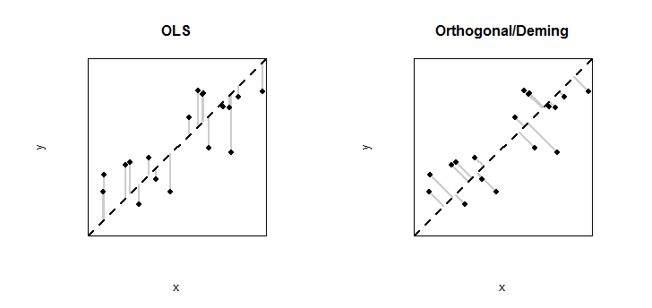

 
 

## **Motivation**

A straightforward linear regression model is frequently employed to investigate and calibrate different algorithms which use remotely sensed observations to predict quantities of in-situ determinands, key assumptions on which the linear model is based are often overlooked in practice.  

Typically, a standard linear regression model assumes that one variable, known as the response variable, can be explained using a linear combination of one or more other variables, known as a predictor, or explanatory variables.  In addition there is also an error term which captures the error in the response that cannot be explained using the linear model.  Within this description of the relationship it is implicit that the response variable is dependent on the explanatory variable and, while this is an appropriate assumption to make in many situations, in a calibration situation, this is not the case.  Standard linear regression models assume that there is no measurement error associated with the explanatory measurement, and only the response has been measured with some degree of imprecision. 

If it is thought that there is error associated with both the response and the explanatory variables and this is not taken into account in some way, the parameters estimated to describe the relationship between the variables, will potentially be biased.  The results of any hypothesis tests on the regression parameters estimated may therefore be invalid.  In addition, not taking into account the presence of error on both sides will result in a calibration line which is asymmetric and improperly weighted.

There are several regression techniques, often referred to as error-in-variables models, which which take into account errors in both variables.  Many of these techniques make use of assumptions about the variance which are derived from available prior information. 

## **Orthongonal/Deming Regression**

Orthogonal Regression allows for imprecision in both the reference and test method measurements by choosing the line that minimises the sum of squared differences from the observations to the line that are in a direction at right angles to the line. Deming Regression (Deming,1943) extends orthogonal regression for minimisation of distances at an angles other than 90 degrees. This approach is becoming increasingly adopted in measurement comparison studies and is discussed in detail in Linnet, 1993.

Deming regression incorporates information using an error variability ratio, \(lambda\) If \( lambda=0\)rdinary least squares regression is obtained and when \(lambda=1\) this is equivalent to orthogonal regression.  In practice \(\lambda\) controls the angle of distances whose sum of squares is minimised. By allowing \(\lambda\) to vary unequal error variances can be accounted for and least squares can be used to minimise the residual error.

While standard Deming regression assumes a homoscedastic error structure, weighted Deming regression introduces a set of weights in the sum of squared deviations and cross products. The weights used in this app are defined in Linnet (1990). Standard errors can be obtained for the slope estimate computed using Deming regression, standard errors for weighted Deming regression can be obtained using jacknife or bootstrap procedures. Confidence limits for the estimates computed within this app are calculated from 1000 bootstrap samples  

The figure below shows an example of the distances minimised in order estimate the regression coefficients for linear regression fitted using the standard approach of ordinary least squares (left hand panel) and he distances minimised in order estimate the regression coefficients when orthogonal/Deming regression is used.

   

## **References**

* Deming, W. E. (1943) Statistical adjustment of data. John Wiley and Sons, New York. 

* Linnet, K. (1993) Evaluation of Regression Procedures for Methods Comparison Studies. CLIN. CHEM. 39/3, 424-432.

* Linnet, K. (1990) Estimation of the Linear Relationship between the Measurements of two Methods with Proportional Errors. STATISTICS IN MEDICINE, Vol. 9, 1463-1473.

